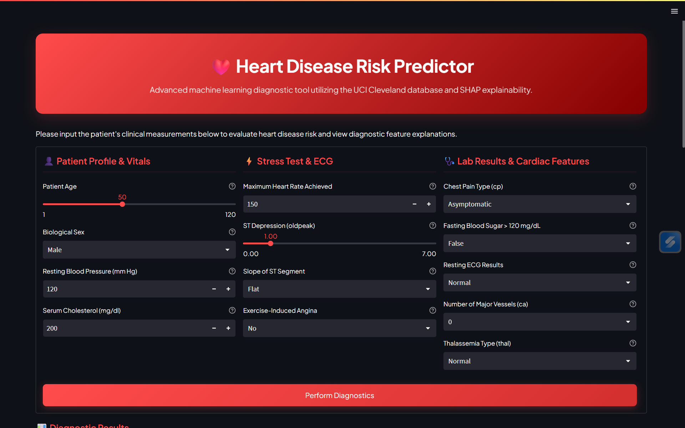
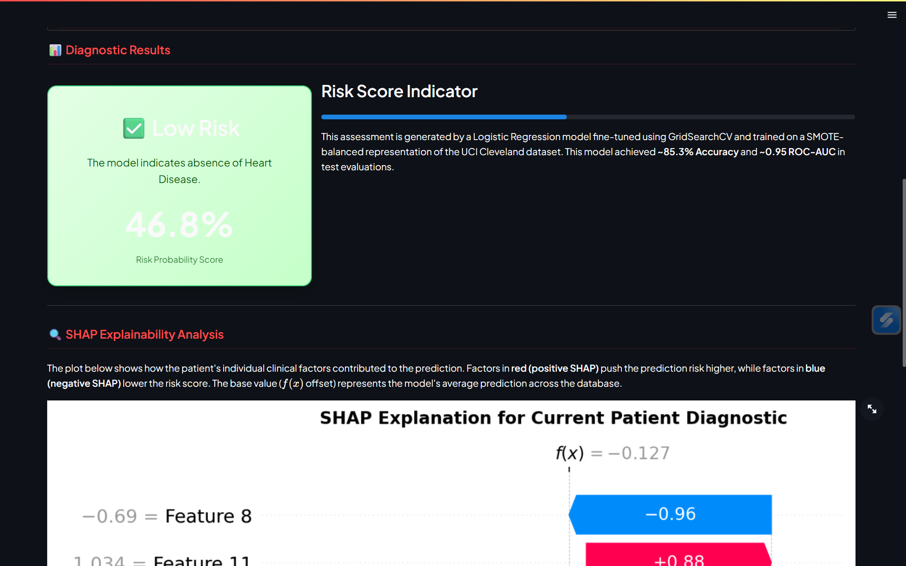
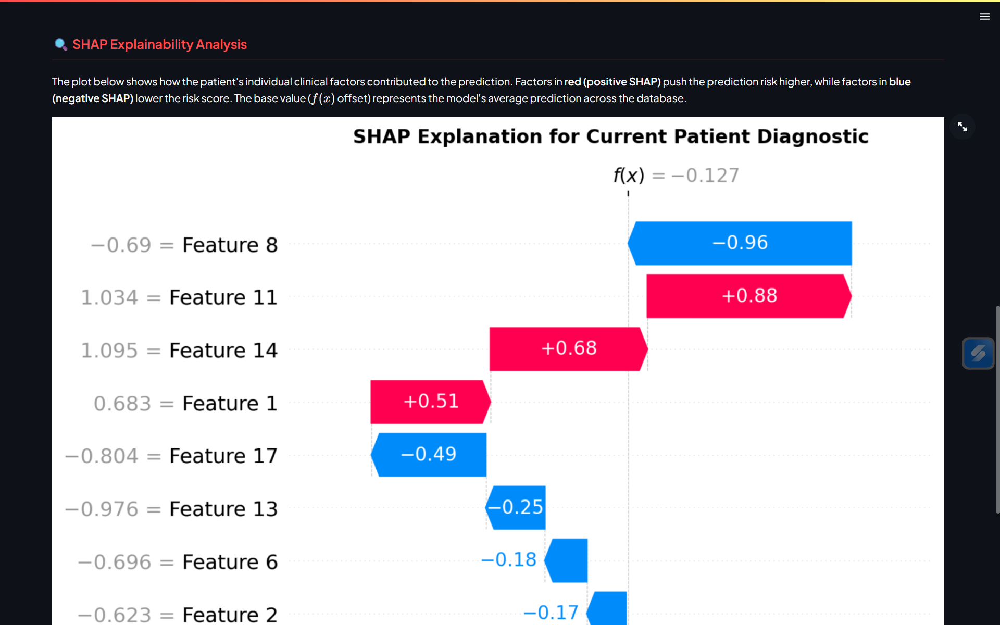

<div align="center">

# ❤️ Heart Disease Risk Prediction System

**Machine Learning-powered Healthcare Application** for predicting heart disease risk using patient clinical data. Built with **Python, Scikit-learn, Streamlit, SHAP, and Logistic Regression** to provide accurate risk assessment and explainable AI insights.

<br/>


<br/>


</div>

---

# 🩺 Project Overview

Heart Disease is one of the leading causes of death worldwide. Early prediction and diagnosis can significantly improve patient outcomes.

This project uses **Machine Learning** to predict whether a patient is at risk of heart disease based on clinical and physiological parameters. The application provides:

* Real-time heart disease risk prediction
* Probability-based risk assessment
* Explainable AI using SHAP values
* Interactive Streamlit dashboard
* Data preprocessing and feature engineering pipeline

---

# 🏗️ System Architecture

```text
Patient Clinical Data
          │
          ▼
Data Preprocessing
(Missing Values + Encoding)
          │
          ▼
Feature Scaling
(StandardScaler)
          │
          ▼
Logistic Regression Model
          │
          ▼
Risk Prediction
          │
          ▼
SHAP Explainability
          │
          ▼
Interactive Streamlit Dashboard
```

---

# 🛠️ Tech Stack

| Category                 | Technology          |
| ------------------------ | ------------------- |
| Programming Language     | Python              |
| Machine Learning         | Scikit-learn        |
| Frontend                 | Streamlit           |
| Data Processing          | Pandas, NumPy       |
| Visualization            | Matplotlib, Seaborn |
| Explainable AI           | SHAP                |
| Model Persistence        | Joblib              |
| Imbalanced Data Handling | SMOTE               |

---

# 📁 Repository Structure

```text
Heart-disease-prediction/
│
├── app.py
├── train_model.py
├── Heart_disease_risk.ipynb
│
├── processed.cleveland.data
├── heart.csv
│
├── logistic_regression_heart.pkl
├── SVM_heart.pkl
├── scaler.pkl
├── columns.pkl
│
├── requirements.txt
├── README.md
│
├── scratch/
│   ├── check_cols.py
│   ├── check_libs.py
│   ├── run_gridsearch.py
│   ├── test_shap_plot.py
│   └── shap_test_waterfall.png
│
└── .gitignore
```

---

# 📊 Dataset Information

The project is trained using the **UCI Cleveland Heart Disease Dataset**.

### Features

| Feature  | Description                 |
| -------- | --------------------------- |
| age      | Age of patient              |
| sex      | Gender                      |
| cp       | Chest pain type             |
| trestbps | Resting blood pressure      |
| chol     | Serum cholesterol           |
| fbs      | Fasting blood sugar         |
| restecg  | Resting ECG results         |
| thalach  | Maximum heart rate achieved |
| exang    | Exercise-induced angina     |
| oldpeak  | ST depression               |
| slope    | Slope of ST segment         |
| ca       | Number of major vessels     |
| thal     | Thalassemia                 |

### Target Variable

| Value | Meaning               |
| ----- | --------------------- |
| 0     | No Heart Disease      |
| 1     | Heart Disease Present |

---

# ⚙️ Machine Learning Pipeline

### 1. Data Cleaning

* Handle missing values
* Remove inconsistencies
* Prepare dataset for training

### 2. Feature Engineering

* One-Hot Encoding
* Feature Selection
* Data Transformation

### 3. Feature Scaling

```python
StandardScaler()
```

Normalizes numerical features.

### 4. Class Balancing

```python
SMOTE()
```

Addresses dataset imbalance.

### 5. Hyperparameter Tuning

```python
GridSearchCV()
```

Optimizes Logistic Regression parameters.

### 6. Model Training

Algorithms explored:

* Logistic Regression ✅
* Support Vector Machine (SVM)

### 7. Explainable AI

```python
SHAP
```

Provides local feature importance and prediction explanations.

---

# 🤖 Trained Models

| Model                  | Status             |
| ---------------------- | ------------------ |
| Logistic Regression    | Production Model   |
| Support Vector Machine | Experimental Model |

Saved Artifacts:

```text
logistic_regression_heart.pkl
scaler.pkl
columns.pkl
```

---

# 📈 Application Features

### Risk Prediction

Predicts probability of heart disease.

### Explainable AI

SHAP Waterfall Plots show:

* Positive contributing factors
* Negative contributing factors
* Individual prediction explanations

### Interactive Dashboard

Built using Streamlit:

* User-friendly interface
* Real-time predictions
* Visual feedback
* Risk score display

---
# 📷 Application Screenshots

## Home Page



## Prediction Results



## SHAP Explainability



# 🚀 How to Run

### Clone Repository

```bash
git clone https://github.com/your-username/Heart-disease-prediction.git
cd Heart-disease-prediction
```

### Install Dependencies

```bash
pip install -r requirements.txt
```

### Train Model

```bash
python train_model.py
```

### Launch Application

```bash
streamlit run app.py
```

---

# 📷 Application Workflow

```text
Enter Patient Information
          │
          ▼
Click Predict
          │
          ▼
Risk Percentage Generated
          │
          ▼
SHAP Explanation Displayed
          │
          ▼
Prediction Result Shown
```

---

# 🎯 Future Improvements

* Random Forest & XGBoost Models
* Deep Learning Implementation
* PDF Health Report Generation
* Personalized Health Recommendations
* Doctor Recommendation System
* Cloud Deployment
* API Integration
* Risk Trend Analysis Dashboard

---

# ⚠️ Disclaimer

This application is intended for educational and research purposes only. Predictions generated by the model should not be considered medical advice or a substitute for consultation with qualified healthcare professionals.

---

# 👨‍💻 Author

**Manmadh Gonela**

Machine Learning Enthusiast | Data Science Learner | Aspiring AI Engineer

---

## ⭐ Support

If you found this project useful, consider giving it a ⭐ on GitHub.

